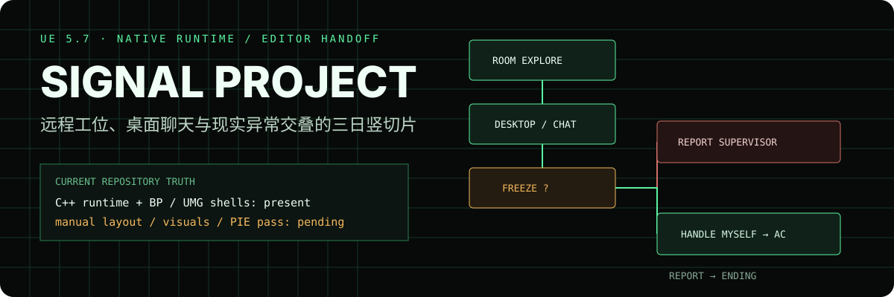

<p align="center">
  
</p>

# Signal Project

Signal Project 是一个 Unreal Engine 5.7 混合竖切片工程：玩家在压迫感的 3D 公寓与 2D 工作桌面之间切换，通过聊天与小游戏推进流程；当 `FREEZE` 异常出现时，选择上报主管或亲自处理空调，从而进入不同对话与结局反馈。

## 当前仓库真实状态

这是一个已经落下 native runtime、Editor shell assets 与主关卡的混合工程，但还不是可直接发布的完整游戏。

**仓库已经包含：**

- UE 5.7 `.uproject` 与 `SignalProject` C++ runtime module；
- 流程、路线、异常、聊天、小游戏、交互物、玩家、报告和结尾的 native authority classes；
- `Content/Signal/` 下的 Blueprint/UMG shell assets、六个已导入 DataTable 与 `LV_ApartmentMain.umap`；
- 已指向 `LV_ApartmentMain` 与 `BP_SignalGameMode` 的启动配置；
- 自动化创建的 runtime actors、class defaults 与 instance bindings；
- Day 1–3 竖切片的权威状态机、Editor 工具和 first-playable smoke test。

**仍需人工完成并验证：**

- 公寓 whitebox、桌面/空调空间关系、mesh、碰撞、灯光与镜头；
- 七套 UMG shell 的可用 designer tree、布局、视觉与按钮 hookup；
- Blueprint 默认值和交互距离的实际手感调整；
- 两条异常分支从开场到结尾的 PIE 全流程验证；
- 报告注入区和 richer ending state 的最终呈现。

[`bootstrap/editor-landing/manual-only-editor-finish-checklist.md`](bootstrap/editor-landing/manual-only-editor-finish-checklist.md) 是当前完成度最直接的交接证据。较早的 `work-item-*-editor-pending.md` 中若出现“资产尚未创建”之类描述，应以实际 `Content/`、启动配置和这份 manual-only checklist 为准。

## 竖切片的可证明主循环

```text
Boot → RoomExplore → DesktopIdle → ChatActive → MinigameActive
                                                   ↓
                                             AnomalyChoice
                                             /             \
                           Report Supervisor                 Handle Myself
                                  ↓                                ↓
                         ReportPhase              HandleAnomaly3D → AC resolve
                                  ↓                                ↓
                          bad feedback        return to desktop → hidden dialogue
                                                                   ↓
                                                        ReportPhase → good feedback
```

冻结范围是 Day 1 建立规则、Day 2 跑通唯一完整 `FREEZE` 异常链、Day 3 收束。`BLACKOUT`、`DISKCLEAN`、额外小游戏和 Day 4–7 只允许作为未来占位，不属于当前可执行边界。

## 第一次打开

要求安装 **Unreal Engine 5.7** 及对应 C++ 编译工具链。

1. 为 `SignalProject.uproject` 生成 IDE project files，并编译 `SignalProjectEditor` target。
2. 用 UE 5.7 打开 `SignalProject.uproject`；启动关卡已配置为 `LV_ApartmentMain`。
3. 先阅读 [`bootstrap/editor-landing/manual-only-editor-finish-checklist.md`](bootstrap/editor-landing/manual-only-editor-finish-checklist.md)，不要重复已经自动化的 DataTable、shell asset、actor placement 与 binding 工作。
4. 完成人工 whitebox、interactable presentation 与 UMG designer tree。
5. 最后逐项执行 [`bootstrap/first-playable-smoke-test.md`](bootstrap/first-playable-smoke-test.md)，分别验证两个分支。

如果启动关卡、BP defaults 或 instance refs 与 checklist 不一致，再使用 `bootstrap/editor-tools/unreal_python/` 下的验证脚本定位问题；不要无条件重跑会覆盖人工调整的自动化步骤。

## 权威文档顺序

如果文档之间发生冲突，竖切片先服从：

1. [`docs/vertical-slice-scope.md`](docs/vertical-slice-scope.md)
2. [`docs/game-state-machine.md`](docs/game-state-machine.md)
3. [`docs/interaction-spec.md`](docs/interaction-spec.md)

实现与 Editor 落地再依次参考：

- [`docs/vertical-slice-18-blueprints-implementation-spec.md`](docs/vertical-slice-18-blueprints-implementation-spec.md)
- [`docs/vertical-slice-blueprint-wiring-order.md`](docs/vertical-slice-blueprint-wiring-order.md)
- [`docs/blueprint-variables-events-and-data-fields.md`](docs/blueprint-variables-events-and-data-fields.md)
- [`docs/day1-day3-datatable-ready-script.md`](docs/day1-day3-datatable-ready-script.md)
- [`bootstrap/README.md`](bootstrap/README.md)

`bootstrap/asset-manifest.csv` 是目标清单；是否已落地应以 `Content/` 中的实际资产、`Config/DefaultEngine.ini` 和 manual-only checklist 交叉确认。

## Native ownership map

| Boundary | C++ owner |
|---|---|
| 主状态与 Day 流程 | `ASignalGameFlowManager` |
| 上报/自处理分支 | `ARouteStateManager` |
| `FREEZE` 激活与解除 | `AAnomalyManager` |
| 聊天与隐藏选项 | `AChatConversationManager`、`AHiddenDialogueUnlocker` |
| 小游戏与异常弹窗 | `AMinigameManager`、`UDependencyMatchWidget` |
| 3D 电脑/空调交互 | `AComputerTerminal`、`AAirConditionerUnit` |
| 桌面、聊天、任务、报告 UI | native `UUserWidget` bases |
| 玩家输入模式与结尾显示 | `ASignalPlayerController` |

所有主状态切换应走统一 flow-manager 边界；不要让 Blueprint 或 widget 绕过 route/report gates 直接改 phase。

## 剩余 Editor 完成顺序（摘要）

```text
native compile + open existing LV_ApartmentMain
  → verify existing BP / UMG shells, DataTables and bindings
  → build apartment whitebox and place visible interactables
  → author usable UMG visual trees and button hookups
  → tune defaults, collision and interaction feel
  → run both branch smoke tests in PIE
```

Native-to-derived 对照仍可查 [`bootstrap/editor-landing/native-class-to-derived-asset-matrix.md`](bootstrap/editor-landing/native-class-to-derived-asset-matrix.md)，手工引用表在 [`bootstrap/editor-landing/level-manual-ref-binding-sheet.md`](bootstrap/editor-landing/level-manual-ref-binding-sheet.md)。不要把“shell asset 存在”误解为“视觉与交互已经人工验收”。

## Scope guardrails

- 当前唯一完整小游戏是 `DependencyMatch`。
- 当前唯一实际异常是 `FREEZE`，唯一 3D 处理对象是空调。
- `Handle Myself` 路线必须先解决异常、手动回到电脑并消费隐藏对话，才能进入报告。
- `Report Supervisor` 路线不离开桌面，也不解锁隐藏对话。
- 不要在竖切片交付前扩展存档、设置、多异常并行、完整七日剧情或额外小游戏。

## License

仓库当前没有许可证文件。项目源码、文档、游戏概念与内容不应被视为已获得再分发许可。
